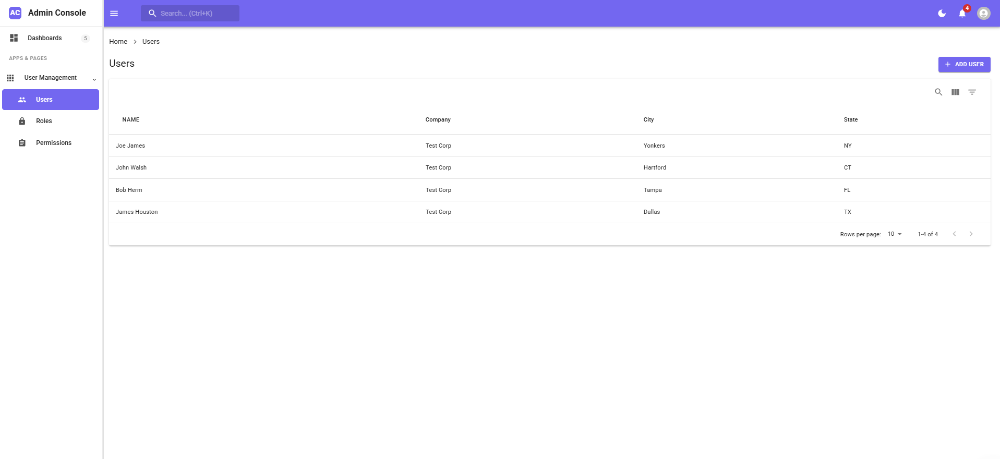

## Getting Started

> [!NOTE]  
> We are using **Next 15** with **React 19**, follow these steps:

Clone the repo:

```
git clone https://github.com/devghor/next-mui-starter.git
```

- `pnpm install`
- `pnpm run dev`

You should now be able to access the application at http://localhost:3000.

> [!WARNING]
> After cloning or forking the repository, be cautious when pulling or syncing with the latest changes, as this may result in breaking conflicts.

## Features

- Modern admin dashboard interface
- Responsive layout with sidebar navigation
- Ready-to-use components (Breadcrumb, Dashboard, Navbar, etc.)
- Pre-configured theme system
- React pro sidebar added


