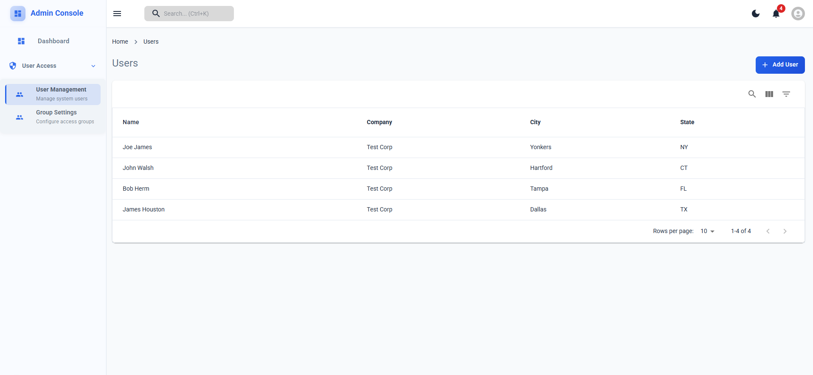

## Getting Started

First, run the development server:

```bash
npm run dev
# or
yarn dev
# or
pnpm dev
# or
bun dev
```

Open [http://localhost:3000](http://localhost:3000) with your browser to see the result.

## Features

- Modern admin dashboard interface
- Responsive layout with sidebar navigation
- User management table with search
- Ready-to-use components (Breadcrumb, Dashboard, Navbar, etc.)
- Pre-configured theme system
- Optimized font loading with next/font


